<!-- =========================================================================
     ANIMATED GITHUB CONTRIBUTION HEATMAP (Cell-by-cell diagonal reveal)
     Auto-refreshed daily by .github/workflows/update-profile-art.yml
     ========================================================================= -->

<h3><code>jayesh@github ~ $ ./contributions.sh</code></h3>

 
 

<!-- =========================================================================
     ASCII PORTRAIT (Left) + STREAK & STATS TERMINAL CARD (Right)
     Both SVGs are 840x880 to ensure identical heights in side-by-side display.
     ========================================================================= -->

<h3><code>jayesh@github ~ $ whoami</code></h3>

<table>
<tr>
<td valign="top"></td>
<td valign="top"></td>
</tr>
</table>

 
 

<!-- =========================================================================
     TECH STACK & CAPABILITIES
     ========================================================================= -->

<h3><code>jayesh@github ~ $ ./stack.sh</code></h3>

<b>Fullstack Developer · AI Vibe Coder · Software Craftsman</b>

  
  
  
  
  
  
  
  
  

 
 

<!-- =========================================================================
     FEATURED PROJECTS (Pinned)
     ========================================================================= -->

<h3><code>jayesh@github ~ $ ./projects.sh --pinned</code></h3>

<table>
<tr>
<td width="50%" valign="top">
  <h4>🎬 <a href="https://github.com/Mercyy00/CINEVAULT">CINEVAULT</a> 📌</h4>
  
A modern, responsive movie and TV streaming platform built for discovering, browsing, and watching entertainment content.

  
<code>TypeScript</code> · <code>React</code> · <code>Tailwind</code> · <code>Streaming UI</code>

</td>
<td width="50%" valign="top">
  <h4>🏥 <a href="https://github.com/Mercyy00/PharmaBridge">PharmaBridge</a> 📌</h4>
  
Pharmaceutical supply chain & healthcare compliance distribution platform with role-based authentication and audit portals.

  
<code>React 19</code> · <code>Vite</code> · <code>Bootstrap 5</code>

</td>
</tr>
<tr>
<td width="50%" valign="top">
  <h4>⚡ <a href="https://github.com/Mercyy00/JARVIS">JARVIS / VYRA</a> 📌</h4>
  
Modular autonomous AI desktop & voice assistant with persistent memory, multi-provider LLM brain, and PC control.

  
<code>Python</code> · <code>AI Agents</code> · <code>Voice AI</code>

</td>
<td width="50%" valign="top">
  <h4>🌿 <a href="https://github.com/Mercyy00/SpiceBridge">SpiceBridge</a> 📌</h4>
  
Indian Spice & Agro Export Portal — B2B commodity catalog, bulk RFQ workflows, and international quality compliance.

  
<code>React</code> · <code>REST API</code> · <code>AgroTech</code>

</td>
</tr>
<tr>
<td width="50%" valign="top">
  <h4>🎓 <a href="https://github.com/Mercyy00/Java-React-Student-Management">Java Fullstack Student Management</a> 📌</h4>
  
Complete enterprise CRUD architecture with Java Servlets, JDBC DAO pattern, MySQL database, and modern React UI.

  
<code>Core Java</code> · <code>MySQL</code> · <code>React</code> · <code>JDBC</code>

</td>
<td width="50%" valign="top">
  <h4>🚜 <a href="https://github.com/Mercyy00/FarmDirect">FarmDirect</a> 📌</h4>
  
Direct farm-to-door organic marketplace with interactive cart drawer and sustainable producer profiles.

  
<code>React</code> · <code>TypeScript</code> · <code>Tailwind CSS</code>

</td>
</tr>
</table>

 
 

<!-- =========================================================================
     LINKS & CONNECT
     ========================================================================= -->

<h3><code>jayesh@github ~ $ ./links.sh</code></h3>

  

 

